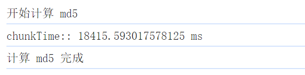
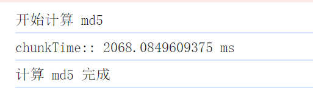

# 项目说明

minio大文件分片上传、续传、秒传demo

# 项目技术

- 前端：vue@3.4 + TypeScript + arco design vue + axios
- 后端：nestjs + Redis + minio  + mysql

# 注意事项

## Woker 线程注意事项

- 前端采用多线程计算分片 md5，然后使用 **MerkleTree** 计算文件的 hash。相较于单线程计算 md5，会节省 70% ~ 80% 的时间 

优化前，一个 2.1G 的文件上传耗时 18s

优化后仅 2 s

### 缺陷

- 由于 MerkleTree 是采用每个分片的叶子节点进行计算，而分片大小会影响分片的 md5，进而影响整个文件的树根节点 hash，所以**不能随意变动分片大小，否则 MerkleTree 计算出来的 md5 将会改变，后台将会重新识别为一个新文件进行上传**

- ## minio 注意事项

- minio 开启了公共只读策略，所以不需要进行签名访问
- 如何开启 minio 公共只读策略？**见 service 文件夹（后端）的测试类 `ReactMinioSpringApplicationTests`**
